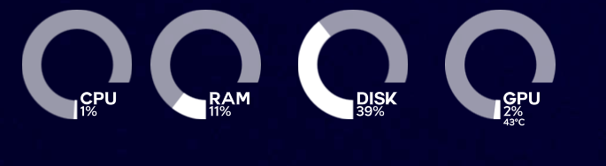

# Thot Disk – KDE Plasma Disk Usage Widget

for more information and setup instruction go read https://github.com/kriansh/thot-disk-inspirational/blob/main/README.md

I am too lazy to rewrite same instructions :p .

Please check out ZayronXIO at https://store.kde.org/u/zayronXIO . He was the inspiration for this project and I used his base code to build this project.
